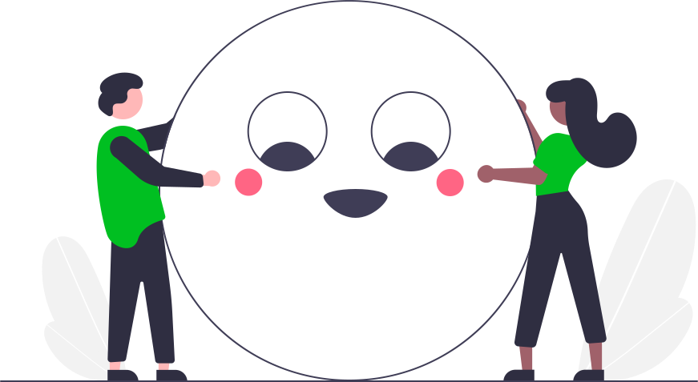

<p align="center">
  <a href="#">
    
  </a>
</p>

<p align="center">
  Consume popular <em>open-source</em> <strong>emoji</strong> libraries as SVG's.
</p>

<br />

<p align="center">
  <a href="#why"><strong>Why?</strong></a> ·
  <a href="#getting-started"><strong>Getting Started</strong></a> ·
  <a href="#future"><strong>Future</strong></a> ·
  <a href="docs"><strong>Docs</strong></a> ·
  <a href="docs/contributing.md"><strong>Contributing</strong></a>
</p>

<br />

<p align="center">
  <a href="https://github.com/svgmoji/svgmoji/actions?query=workflow:ci">
    
  </a>
  <a href="https://github.com/svgmoji/svgmoji/actions?query=workflow:docs">
    
  </a>
</p>

<br />

## Why?

Consume open source emoji libraries as vector graphics (`.svg`). The bundle size is smaller and the image scales better with high resolution devices.

This library tracks the most popular emoji projects that I'm aware of and makes their SVG available as sprites which can be consumed.

### [noto](https://github.com/googlefonts/noto-emoji)

<br />
<p align="center">
  <a href="#"></a>&nbsp;&nbsp;&nbsp;<a href="#"></a>&nbsp;&nbsp;&nbsp;<a href="#"></a>&nbsp;&nbsp;&nbsp;<a href="#"></a>&nbsp;&nbsp;&nbsp;<a href="#"></a>&nbsp;&nbsp;&nbsp;<a href="#"></a>&nbsp;&nbsp;&nbsp;<a href="#"></a>&nbsp;&nbsp;&nbsp;<a href="#"></a>&nbsp;&nbsp;&nbsp;<a href="#"></a>&nbsp;&nbsp;&nbsp;<a href="#"></a>
</p>

```html


<!-- GZIP 3.8MB -->

```

### [blobmoji](https://github.com/c1710/blobmoji)

<br />
<p align="center">
  <a href="#"></a>&nbsp;&nbsp;&nbsp;<a href="#"></a>&nbsp;&nbsp;&nbsp;<a href="#"></a>&nbsp;&nbsp;&nbsp;<a href="#"></a>&nbsp;&nbsp;&nbsp;<a href="#"></a>&nbsp;&nbsp;&nbsp;<a href="#"></a>&nbsp;&nbsp;&nbsp;<a href="#"></a>&nbsp;&nbsp;&nbsp;<a href="#"></a>&nbsp;&nbsp;&nbsp;<a href="#"></a>&nbsp;&nbsp;&nbsp;<a href="#"></a>
</p>

```html
<!-- Individual -->


<!-- Subgroup Bundle -->


<!-- Grouped Bundle -->


<!-- Full Sprite Bundle -->

```

### [twemoji](https://github.com/twitter/twemoji)

> Attributes requirements are outlined [here](https://github.com/twitter/twemoji#attribution-requirements).

<br />

<p align="center">
  <a href="#"></a>&nbsp;&nbsp;&nbsp;<a href="#"></a>&nbsp;&nbsp;&nbsp;<a href="#"></a>&nbsp;&nbsp;&nbsp;<a href="#"></a>&nbsp;&nbsp;&nbsp;<a href="#"></a>&nbsp;&nbsp;&nbsp;<a href="#"></a>&nbsp;&nbsp;&nbsp;<a href="#"></a>&nbsp;&nbsp;&nbsp;<a href="#"></a>&nbsp;&nbsp;&nbsp;<a href="#"></a>&nbsp;&nbsp;&nbsp;<a href="#"></a>
</p>

```html
<!-- Individual -->


<!-- Subgroup Bundle -->


<!-- Grouped Bundle -->


<!-- Full Sprite Bundle -->

```

### [openmoji](https://github.com/hfg-gmuend/openmoji)

<br />

> All emojis designed by [OpenMoji](https://openmoji.org/) – the open-source emoji and icon project. License: [CC BY-SA 4.0](https://creativecommons.org/licenses/by-sa/4.0/#). Requirements for attribution are outlined [here](https://github.com/hfg-gmuend/openmoji/blob/master/FAQ.md#-whats-the-license-of-openmoji-for-app--website--book--ad--video--projects).

<p align="center">
  <a href="#"></a>&nbsp;&nbsp;&nbsp;<a href="#"></a>&nbsp;&nbsp;&nbsp;<a href="#"></a>&nbsp;&nbsp;&nbsp;<a href="#"></a>&nbsp;&nbsp;&nbsp;<a href="#"></a>&nbsp;&nbsp;&nbsp;<a href="#"></a>&nbsp;&nbsp;&nbsp;<a href="#"></a>&nbsp;&nbsp;&nbsp;<a href="#"></a>&nbsp;&nbsp;&nbsp;<a href="#"></a>&nbsp;&nbsp;&nbsp;<a href="#"></a>
</p>

```html
<!-- Individual -->


<!-- Subgroup Bundle -->


<!-- Grouped Bundle -->


<!-- Full Sprite Bundle -->

```

<br />

## Getting Started

Install the **emoji** library of your choice.

```bash
pnpm add @svgmoji/noto
```

You can consume the library in the following way.

```ts
import { Notomoji } from '@svgmoji/notomoji';
import data from 'svgmoji/emoji.json';

const notomoji = new Notomoji({ data, type: 'all' });
const image = document.createElement('img');
image.src = notomoji.url('❤️');

document.body.append(image);
```

The above code will reference the svg sprite image from the cdn. This is a huge file (3000+ emoji) and although it's a one off download cost, you may prefer to be more incremental.

The `type` parameter can be updated to reflect how you want to reference the emoji.

```ts
// Will load the cdn sprite for the emoji groups.
// There are 10 groups in total some of which rarely get used.
const groupNotomoji = new Notomoji({ data, type: 'group' });

// Will load the cdn sprite for the subgroup. Smaller download size,
// but if you are using a large variety of emoji, it could lead to
// delayed load times.
const subGroupNotomoji = new Notomoji({ data, type: 'subgroup' });

// Loads each emoji as a direct url. This is useful if emoji are
// rarely used in your codebase.
const individualNotomoji = new Notomoji({ data, type: 'individual' });
```

Documentation is still very much a work in progress and more is to come.

<br />

## Future

- [x] Optimize the individual SVG's with `svgo`.
- [ ] Add `React` support to all libraries.

  ```tsx
  import { SvgMoji } from `@svgmoji/noto/react`;

  const MyMoji = () => {
    return <SvgMoji unicode='💋' />;
  };
  ```

- [ ] Add `React Native` components.
- [ ] Add `Vue` components.
- [ ] Add `Svelte` components.
- [ ] Add SVG **CSS** support.
- [ ] Add metrics for sizes of the group, subgroup, and other sizes for metric.
- [ ] Add new package `@svgmoji/openmoji-black` for `openmoji` black and white emoji support.
- [ ] Add support for css backgrounds.
- [ ] Add font consumption support.

## Contributing

Please read our [contribution guide] for details on our code of conduct, and the process for submitting pull requests. It also outlines the project structure so you can find help when navigating your way around the codebase.

In addition each folder in this codebase a readme describing why it exists.

You might also notice there are surprisingly few files in the root directory of this project. All the configuration files have been moved to the `support/root` directory and are symlinked to the root directory in a `preinstall` hook. For more information take a look at [folder](support/root) and [readme](support/root/readme.md).

<br />

## Versioning

This project uses [SemVer](http://semver.org/) for versioning. For the versions available, see the [tags on this repository](https://github.com/svgmoji/svgmoji/tags).

<br />

## License

This project is licensed under the MIT License - see the [LICENSE](LICENSE) file for details

[contribution guide]: docs/contributing
[typescript]: https://github.com/microsoft/Typescript
